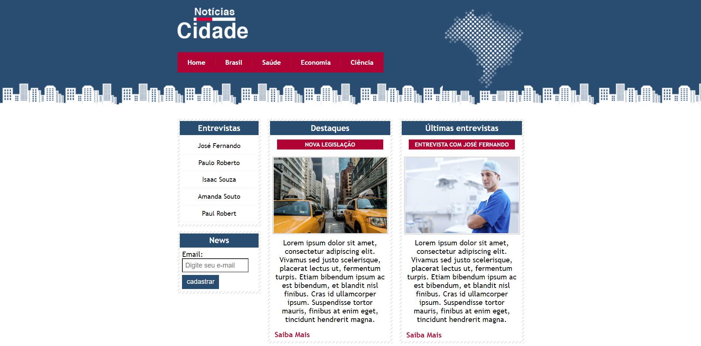
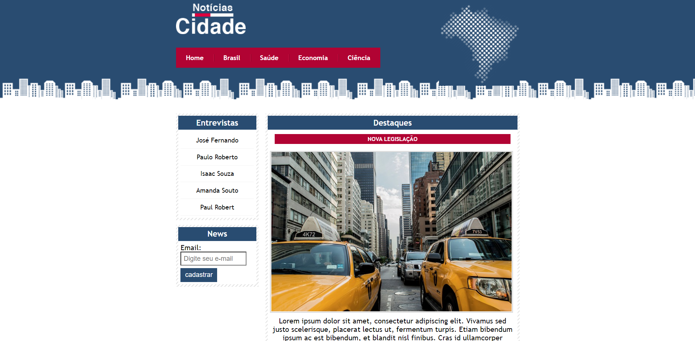

# Site notícias da cidade

#### Esse projeto consiste no desenvolvimento de um site de notícias fictício a fim de aplicar os conhecimentos em html5 e CSS3.

### O projeto foi dividido da seguinte forma:

  - **index.html**: Página inicial do site;
  - **brasil.html**: Uma página de exemplo.
  - **css**: Pasta que contêm a folha de estilo css.
  - **src**: Pasta que contêm as imagens utilizadas para o desenvolvimento do site
  - **examples**: Pasta que contêm os prints de exemplos, que podem ser observados abaixo.
  
&nbsp;

&nbsp;

